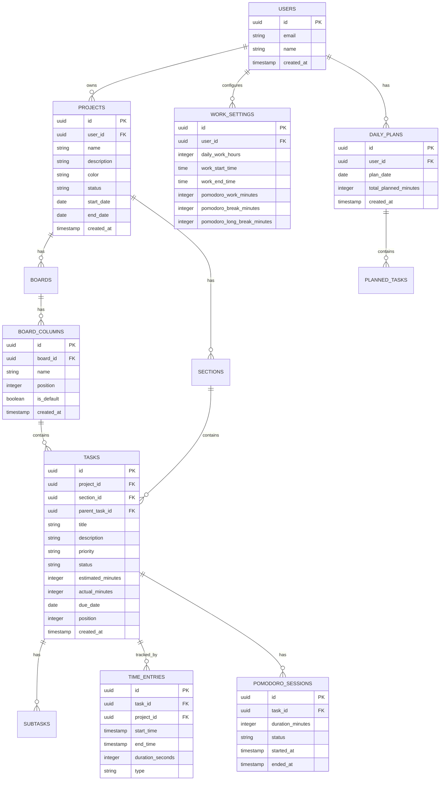
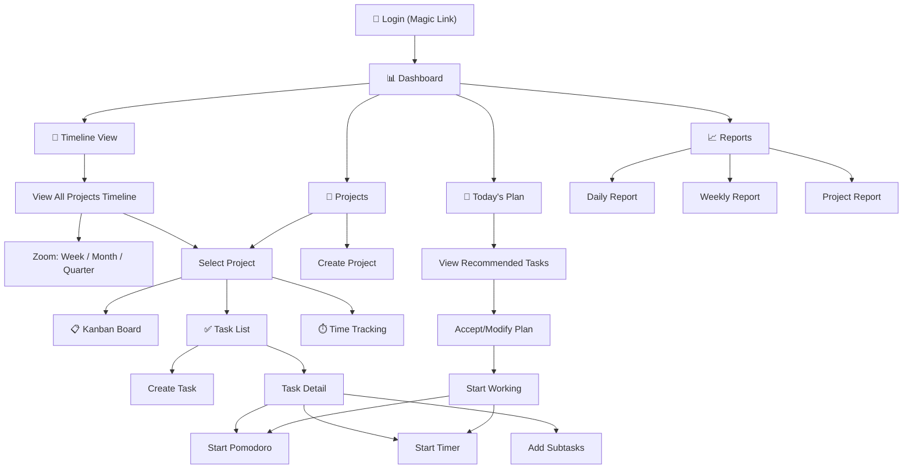

# 🚀 Tasktik — Brainstorming & Dokumentasi Konsep

> **Tanggal:** 17 Februari 2026  
> **Status:** ✅ Final — Ready for Development  
> **Nama Aplikasi:** Tasktik (Task + Taktik)  
> **Tujuan:** Membangun aplikasi produktivitas all-in-one yang menggabungkan time tracking, Pomodoro, Kanban board, task management, project timeline, dan smart scheduling.

---

## 1. Visi & Misi Aplikasi

### Visi
Menjadi **personal productivity companion** yang membantu pengguna mengelola waktu, task, dan proyek secara efisien — semua dalam satu platform.

### Misi
- Menghilangkan kebutuhan menggunakan banyak aplikasi terpisah (Toggl + Asana + Todoist + Pomodoro app)
- Memberikan **insight berbasis data** tentang kebiasaan kerja pengguna
- Mengoptimalkan jam kerja harian melalui **rekomendasi task cerdas**

### Product Direction
- **Phase 1:** Personal use — fokus pada kebutuhan sendiri, polish UX
- **Phase 2+:** Jadi produk SaaS — multi-user, team collaboration, monetization

---

## 2. Core Features

### 2.1 ⏱️ Time Tracking

**Deskripsi:** Melacak berapa lama waktu yang dihabiskan untuk setiap project dan task.

| Fitur | Detail |
|---|---|
| Start/Stop Timer | Tombol play/pause untuk menjalankan timer secara real-time |
| Manual Entry | Input waktu secara manual jika lupa start timer |
| Per-Project Tracking | Setiap entri waktu terhubung ke project tertentu |
| Per-Task Tracking | Tracking tingkat task untuk granularity lebih detail |
| Daily/Weekly/Monthly Report | Ringkasan waktu kerja dalam bentuk chart dan tabel |
| Timesheet View | Tampilan kalender/tabel yang menunjukkan distribusi waktu |

---

### 2.2 🍅⏱️ Unified Timer (Pomodoro + Free Timer)

**Deskripsi:** Satu komponen timer dengan **2 mode** — Pomodoro (25/5) dan Free Timer (manual). Setiap sesi otomatis tercatat sebagai time entry.

| Fitur | Detail |
|---|---|
| **2 Mode** | 🍅 Pomodoro Mode (25/5/15 configurable) atau ⏱️ Free Timer Mode (manual start/stop) |
| Configurable Duration | Pomodoro: default 25/5/15 menit, bisa di-custom |
| Session Counter | Hitung jumlah pomodoro yang sudah diselesaikan per hari |
| Auto-Link to Task | Timer session otomatis terhubung ke task yang sedang dikerjakan |
| Auto Time Entry | Setiap sesi (Pomodoro maupun Free) otomatis tercatat sebagai time entry |
| Break Reminder | Notifikasi saat kerja habis dan break selesai (Pomodoro mode) |
| Long Break | Setelah 4 pomodoro, otomatis long break (15-30 menit) |
| Focus Mode | Sembunyikan notifikasi lain saat dalam sesi |
| Daily Stats | Statistik timer per hari/minggu |

---

### 2.3 📋 Personal Kanban Board

**Deskripsi:** Board visual ala Asana/Trello untuk mengelola workflow task.

| Fitur | Detail |
|---|---|
| Default Columns | Preset: Backlog → To Do → In Progress → Review → Done |
| Custom Columns | User bisa menambah, menghapus, dan rename kolom sesuai kebutuhan |
| Drag & Drop | Pindahkan task antar kolom dengan drag & drop |
| Multiple Boards | Satu board per project, atau custom board |
| Card Detail View | Klik card untuk melihat detail lengkap task |
| Labels/Tags | Kategorisasi task dengan warna dan label |
| Filters | Filter berdasarkan label, priority, due date |

> [!NOTE]
> MVP akan menyediakan preset columns + kemampuan membuat custom columns.

---

### 2.4 ✅ Task Breakdown & Checklist

**Deskripsi:** Setiap project bisa dipecah menjadi task-task kecil dengan checklist progress.

```
Project: Website Redesign
├── 📁 Phase 1: Research
│   ├── ☑️ Competitive analysis
│   ├── ☑️ User interviews
│   └── ☐ Define personas
├── 📁 Phase 2: Design
│   ├── ☐ Wireframes
│   ├── ☐ High-fidelity mockup
│   └── ☐ Design review
└── 📁 Phase 3: Development
    ├── ☐ Setup project
    ├── ☐ Frontend development
    └── ☐ Backend development
```

| Fitur | Detail |
|---|---|
| Hierarchical Tasks | Project → Section → Task → Subtask |
| Checkbox Progress | Checklist dengan progress bar per section |
| Task Properties | priority, due date, **estimated time**, actual time, description, labels |
| Priority Levels | 🔴 Urgent, 🟠 High, 🟡 Medium, 🟢 Low |
| Progress Tracking | Persentase completion per project dan per phase |

---

### 2.5 🧠 Smart Daily Planner (Work Hours & Recommendations)

**Deskripsi:** Mengatur jam kerja harian dan mendapatkan rekomendasi task berdasarkan priority dan estimasi waktu.

> [!IMPORTANT]
> Ini adalah fitur **pembeda utama** dari aplikasi produktivitas lainnya. Bagian ini dijelaskan secara detail di **Section 3** di bawah.

---

### 2.6 📅 Project Timeline View

**Deskripsi:** Tampilan kalender horizontal yang menampilkan semua project sebagai **block berwarna** dalam durasi bulanan. Mirip Gantt chart/Timeline di Asana, tapi untuk personal use.

```
┌──────────────────────────────────────────────────────────────────┐
│  📅 Timeline                     Februari 2026    ◄  ►  Bulan   │
│  ─────────────────────────────────────────────────────────────── │
│  MY PROJECTS          Minggu 1  │  Minggu 2  │  Minggu 3  │ M4 │
│  ─────────────────────────────────────────────────────────────── │
│                                                                  │
│  🔵 Tasktik App       ██████████████████████████████████████████ │
│                                                                  │
│  🟠 Website Portfolio ████████████████                           │
│                                                                  │
│  🟢 Client Project           ██████████████████████████          │
│                                                                  │
│  🟣 Side Project                        █████████████████████    │
│                                                                  │
│  ─────────────────────────────────────────────────────────────── │
│  Zoom: [Week]  [Month]  [Quarter]                                │
└──────────────────────────────────────────────────────────────────┘
```

| Fitur | Detail |
|---|---|
| **Block project** | Horizontal bar berwarna per project |
| **Zoom level** | Week / Month / Quarter |
| **Color coded** | Setiap project punya warna berbeda (dari project color) |
| **Today indicator** | Garis vertikal merah menandai hari ini |
| **Overlap visibility** | Melihat project mana yang berjalan bersamaan |
| **Click to detail** | Klik block → buka project detail |
| **Month navigation** | Navigasi antar bulan dengan ◄ ► |
| **Personal only** | Menampilkan semua project milik user |

---

## 3. Deep Dive: Smart Daily Planner 🧠

Bagian ini menjelaskan secara mendalam bagaimana fitur **Smart Daily Planner** bekerja — dari input yang dibutuhkan, proses di balik layar, hingga output yang kamu terima setiap hari.

### 3.1 Gambaran Umum

```
┌──────────────────────────────────────────────────────┐
│                SMART DAILY PLANNER                    │
│                                                      │
│   INPUT              PROSES            OUTPUT        │
│   ─────              ──────            ──────        │
│   • Jam kerja    →   Scoring      →   📋 Today's    │
│   • Semua task   →   Algorithm    →      Plan       │
│   • Priority     →   + Fitting    →   ⏰ Timeline   │
│   • Deadline     →                →   📊 Capacity   │
│   • Estimasi     →                →      Indicator   │
│     waktu                                            │
└──────────────────────────────────────────────────────┘
```

**Analogi sederhana:**
> Bayangkan kamu punya **tas ransel berkapasitas 8 jam**. Kamu punya banyak "barang" (task) dengan ukuran berbeda. Smart Planner membantu kamu memilih barang mana yang paling penting untuk dimasukkan hari ini, berdasarkan **seberapa penting** dan **seberapa mendesak** barang tersebut.

### 3.2 Step-by-Step: Cara Kerja

#### Step 1: Kamu Set Jam Kerja (Satu Kali)

Di halaman **Settings**, kamu mengatur:

| Setting | Contoh | Keterangan |
|---|---|---|
| Jam kerja per hari | 8 jam | Total waktu produktif per hari |
| Jam mulai | 09:00 | Kapan mulai kerja |
| Jam selesai | 17:00 | Kapan selesai kerja |

Ini hanya perlu di-set **sekali** dan bisa diubah kapan saja.

#### Step 2: Kamu Buat Task dengan Estimasi Waktu

Saat membuat task, kamu mengisi:
- **Judul** task
- **Priority** (Urgent / High / Medium / Low)
- **Deadline** (opsional tapi sangat membantu)
- **Estimasi waktu** (berapa lama task ini seharusnya dikerjakan)

**Contoh:**

| Task | Priority | Deadline | Estimasi |
|---|---|---|---|
| Fix login bug | 🔴 Urgent | 17 Feb | 2 jam |
| Buat proposal klien | 🟠 High | 18 Feb | 3 jam |
| Tulis dokumentasi API | 🟡 Medium | 21 Feb | 2 jam |
| Riset UI framework | 🟢 Low | - | 1.5 jam |
| Review code PR #42 | 🟠 High | 17 Feb | 1 jam |
| Update unit tests | 🟡 Medium | 19 Feb | 1.5 jam |

> [!TIP]
> **Tips estimasi waktu:**
> - Tidak perlu akurat 100% — perkiraan kasar sudah cukup
> - Seiring waktu, sistem akan belajar dari data aktual vs estimasi kamu
> - Jika ragu, lebih baik over-estimate sedikit (misalnya 2 jam untuk yang mungkin 1.5 jam)

#### Step 3: Setiap Pagi, Buka "Today's Plan"

Saat kamu membuka aplikasi, halaman **Today's Plan** otomatis menampilkan rekomendasi task untuk hari ini. Begini prosesnya di balik layar:

##### 3a. Sistem menghitung **Score** setiap task

```
Score = (Priority Weight × 40%) 
      + (Deadline Urgency × 30%) 
      + (Estimated Duration Fit × 20%) 
      + (Dependency Status × 10%)
```

**Detail perhitungan setiap komponen:**

**① Priority Weight (40% dari total score)**

| Priority | Skor | Alasan |
|---|---|---|
| 🔴 Urgent | 100 | Harus dikerjakan secepat mungkin |
| 🟠 High | 75 | Penting tapi tidak kritis |
| 🟡 Medium | 50 | Standard task |
| 🟢 Low | 25 | Bisa ditunda jika perlu |

**② Deadline Urgency (30% dari total score)**

| Kondisi | Skor | Contoh |
|---|---|---|
| Sudah lewat deadline | 100 | Deadline kemarin |
| Deadline hari ini | 100 | Deadline 17 Feb, sekarang 17 Feb |
| Deadline besok | 80 | Deadline 18 Feb |
| Deadline 2-3 hari lagi | 60 | Deadline 19-20 Feb |
| Deadline minggu ini | 40 | Deadline 21-23 Feb |
| Deadline minggu depan | 20 | Deadline 24+ Feb |
| Tanpa deadline | 10 | Tidak ada deadline |

**③ Duration Fit (20% dari total score)**

Mengukur apakah task ini "pas" dengan sisa kapasitas hari ini:

| Kondisi | Skor |
|---|---|
| Estimasi ≤ sisa waktu yang tersedia | 100 |
| Estimasi sedikit melebihi sisa waktu | 50 |
| Estimasi jauh melebihi sisa waktu | 20 |

**④ Dependency Status (10% dari total score)**

| Kondisi | Skor |
|---|---|
| Tidak punya dependency / dependency sudah selesai | 100 |
| Punya dependency yang belum selesai | 0 |

##### 3b. Sistem mengurutkan task berdasarkan score

Dari contoh task di atas (hari ini = 17 Feb):

| Rank | Task | Priority Score | Deadline Score | Fit Score | Total Score |
|---|---|---|---|---|---|
| 1 | Fix login bug | 40 | 30 | 20 | **90** |
| 2 | Review code PR #42 | 30 | 30 | 20 | **80** |
| 3 | Buat proposal klien | 30 | 24 | 20 | **74** |
| 4 | Update unit tests | 20 | 18 | 20 | **58** |
| 5 | Tulis dokumentasi API | 20 | 12 | 20 | **52** |
| 6 | Riset UI framework | 10 | 3 | 20 | **33** |

##### 3c. Sistem "mengisi" jam kerja kamu

Seperti mengisi tas ransel, sistem memasukkan task dari score tertinggi hingga jam kerja penuh:

```
Kapasitas hari ini: 8 jam
────────────────────────────────────────

✅ 1. Fix login bug          2.0 jam   │ Total: 2.0 jam
✅ 2. Review code PR #42     1.0 jam   │ Total: 3.0 jam
✅ 3. Buat proposal klien    3.0 jam   │ Total: 6.0 jam
✅ 4. Update unit tests      1.5 jam   │ Total: 7.5 jam
⚠️ 5. Tulis dokumentasi API  2.0 jam   │ Total: 9.5 jam ← MELEBIHI 8 JAM!
❌ 6. Riset UI framework     1.5 jam   │ Tidak masuk hari ini

────────────────────────────────────────
📊 Rekomendasi: Task 1-4 (7.5 jam)
💡 Sisa 30 menit: bisa mulai Task 5 sebagian, atau micro-tasks
```

#### Step 4: Kamu Review & Sesuaikan Plan

Setelah melihat rekomendasi, kamu bisa:

| Aksi | Contoh |
|---|---|
| ✅ **Accept** | Terima semua rekomendasi apa adanya |
| 🔄 **Swap** | Tukar "Update unit tests" dengan "Tulis dokumentasi API" |
| ➕ **Add** | Tambahkan task yang tidak direkomendasikan |
| ➖ **Remove** | Hapus task yang ingin ditunda |
| 📝 **Adjust time** | Ubah estimasi jika dirasa terlalu lama/cepat |

#### Step 5: Mulai Kerja!

Setelah plan di-accept:
- Task muncul di **Today's Timeline**
- Kamu tinggal klik **▶ Start** atau **🍅 Pomodoro** pada task pertama
- Waktu otomatis di-track
- Saat selesai, task otomatis pindah ke berikutnya

### 3.3 Tampilan Today's Plan (UI Mockup)

```
┌────────────────────────────────────────────────────────┐
│  📅 Today's Plan — Senin, 17 Februari 2026             │
│                                                        │
│  ⏰ Jam Kerja: 09:00 - 17:00 (8 jam)                   │
│  📊 Terisi: 7.5/8 jam  ████████████████████░  94%      │
│                                                        │
│  ┌─────────────────────────────────────────────────┐   │
│  │ #1  🔴 Fix login bug                            │   │
│  │     ⏱ Est: 2 jam  │  📅 Deadline: Hari ini      │   │
│  │     Score: 90      │  ▶ Start  🍅 Pomodoro      │   │
│  ├─────────────────────────────────────────────────┤   │
│  │ #2  🟠 Review code PR #42                       │   │
│  │     ⏱ Est: 1 jam  │  📅 Deadline: Hari ini      │   │
│  │     Score: 80      │  ▶ Start  🍅 Pomodoro      │   │
│  ├─────────────────────────────────────────────────┤   │
│  │ #3  🟠 Buat proposal klien                      │   │
│  │     ⏱ Est: 3 jam  │  📅 Deadline: Besok         │   │
│  │     Score: 74      │  ▶ Start  🍅 Pomodoro      │   │
│  ├─────────────────────────────────────────────────┤   │
│  │ #4  🟡 Update unit tests                        │   │
│  │     ⏱ Est: 1.5 jam │  📅 Deadline: 19 Feb       │   │
│  │     Score: 58      │  ▶ Start  🍅 Pomodoro      │   │
│  └─────────────────────────────────────────────────┘   │
│                                                        │
│  ── Tidak masuk hari ini ──────────────────────────     │
│  ⬜ 🟡 Tulis dokumentasi API (2 jam) — melebihi jam    │
│  ⬜ 🟢 Riset UI framework (1.5 jam) — low priority     │
│                                                        │
│  [✏️ Edit Plan]  [✅ Accept & Start]                    │
└────────────────────────────────────────────────────────┘
```

### 3.4 Fitur Pendukung

| Fitur | Cara Kerja |
|---|---|
| **Carry-Over** | Task yang tidak selesai hari ini otomatis masuk ke rekomendasi besok dengan score yang lebih tinggi (deadline makin dekat) |
| **Overdue Alert** | Task yang sudah lewat deadline muncul di paling atas dengan badge 🔴 OVERDUE |
| **Capacity Indicator** | Progress bar visual yang menunjukkan berapa persen jam kerja sudah terisi |
| **Actual vs Estimated** | Seiring waktu, sistem bisa menyarankan: *"Task serupa biasanya memakan 1.5× dari estimasi kamu"* |
| **Quick Add to Today** | Tombol cepat untuk menambahkan task dadakan ke plan hari ini |

### 3.5 Skenario Real-Life

#### Skenario A: Hari Normal
> Kamu punya 6 task, totalnya 7.5 jam. Semua masuk ke plan hari ini. Sisa 30 menit bisa untuk email atau micro-tasks.

#### Skenario B: Hari Overloaded
> Kamu punya 10 task, totalnya 15 jam. Sistem hanya merekomendasikan 8 jam worth of tasks berdasarkan priority. Sisanya otomatis disarankan untuk hari berikutnya.

#### Skenario C: Ada Task Dadakan
> Jam 11 pagi ada urgent bug. Kamu tambahkan ke plan → Sistem otomatis re-calculate, dan menyarankan task mana yang perlu digeser ke besok untuk menjaga jam kerja tetap 8 jam.

#### Skenario D: Selesai Lebih Cepat
> Kamu menyelesaikan semua task jam 15:00 (2 jam lebih cepat). Sistem menampilkan: *"🎉 Semua task selesai! Mau ambil task tambahan dari backlog?"*

---

## 4. Arsitektur Teknis

### 4.1 Cross-Platform Tech Stack Comparison

Karena kamu ingin aplikasi ini bisa cross-platform dan punya offline support, berikut perbandingan lengkap opsi yang tersedia:

#### Option A: React Native + Expo (📱 Mobile-First)

| Aspek | Detail |
|---|---|
| **Platform** | iOS, Android, Web (via Expo Web) |
| **Bahasa** | TypeScript / JavaScript |
| **UI** | React Native components |
| **Offline** | ✅ SQLite lokal + Supabase sync |
| **Kelebihan** | Ekosistem besar, native feel, satu codebase → 3 platform |
| **Kekurangan** | Web experience kurang optimal, tidak ada desktop native |
| **Cocok untuk** | Aplikasi yang mayoritas dipakai di mobile |

#### Option B: Flutter (📱 Mobile + Desktop + Web)

| Aspek | Detail |
|---|---|
| **Platform** | iOS, Android, Web, macOS, Windows, Linux |
| **Bahasa** | Dart |
| **UI** | Material/Cupertino widgets |
| **Offline** | ✅ Hive/Isar/Drift lokal + Supabase sync |
| **Kelebihan** | True cross-platform (6 platform), pixel-perfect UI, hot reload |
| **Kekurangan** | Bahasa Dart kurang populer, bundle size besar, web performance masih kalah native |
| **Cocok untuk** | Aplikasi yang butuh presence di semua platform sekaligus |

#### Option C: Next.js PWA (🌐 Web-First)

| Aspek | Detail |
|---|---|
| **Platform** | Web (semua browser), bisa di-install sebagai app di mobile & desktop |
| **Bahasa** | TypeScript / JavaScript |
| **UI** | React + CSS |
| **Offline** | ✅ Service Worker + IndexedDB + Supabase sync |
| **Kelebihan** | Satu codebase, deploy sekali → akses di mana saja, SEO-ready, familiar tech |
| **Kekurangan** | Tidak 100% native feel, akses hardware terbatas, notifikasi push terbatas di iOS |
| **Cocok untuk** | MVP cepat, personal use, gradual improvement |

#### Option D: Tauri + React (🖥️ Desktop + Web)

| Aspek | Detail |
|---|---|
| **Platform** | macOS, Windows, Linux, Web |
| **Bahasa** | TypeScript + Rust (backend) |
| **UI** | React + CSS (web view) |
| **Offline** | ✅ SQLite lokal built-in + Supabase sync |
| **Kelebihan** | Ringan (2-5 MB app size), native desktop experience, Rust backend cepat |
| **Kekurangan** | Tidak ada mobile, ekosistem lebih kecil, learning curve Rust |
| **Cocok untuk** | Aplikasi desktop productivity, developer tools |

### 4.2 Perbandingan Head-to-Head

| Kriteria | React Native | Flutter | Next.js PWA | Tauri |
|---|---|---|---|---|
| Mobile native | ⭐⭐⭐⭐⭐ | ⭐⭐⭐⭐⭐ | ⭐⭐⭐ | ❌ |
| Web experience | ⭐⭐⭐ | ⭐⭐⭐ | ⭐⭐⭐⭐⭐ | ⭐⭐⭐⭐ |
| Desktop native | ❌ | ⭐⭐⭐⭐ | ⭐⭐⭐ | ⭐⭐⭐⭐⭐ |
| Offline support | ⭐⭐⭐⭐ | ⭐⭐⭐⭐⭐ | ⭐⭐⭐ | ⭐⭐⭐⭐⭐ |
| Kecepatan MVP | ⭐⭐⭐⭐ | ⭐⭐⭐ | ⭐⭐⭐⭐⭐ | ⭐⭐⭐ |
| Ekosistem & komunitas | ⭐⭐⭐⭐⭐ | ⭐⭐⭐⭐ | ⭐⭐⭐⭐⭐ | ⭐⭐⭐ |
| Scalability ke produk | ⭐⭐⭐⭐ | ⭐⭐⭐⭐⭐ | ⭐⭐⭐⭐ | ⭐⭐⭐ |
| Learning curve | ⭐⭐⭐⭐ | ⭐⭐⭐ | ⭐⭐⭐⭐⭐ | ⭐⭐⭐ |

### 4.3 🏆 Keputusan Final: Solito Monorepo

> [!IMPORTANT]
> **Keputusan: Solito (Next.js + Expo) — Hybrid Monorepo**

**Skenario penggunaan yang diinginkan:**

```
📱 Di HP (Expo/React Native)          💻 Di Laptop (Next.js Web)
─────────────────────────              ────────────────────────
• Cek task hari ini                    • Start/stop timer kerja
• Lihat progress project               • Manage Kanban board
• Lihat pomodoro stats                 • Buat & breakdown task
• Quick check plan                     • Pomodoro session
• Review notifikasi                    • Smart daily planning
                                       • Reports & analytics
        ↕ SYNC VIA SUPABASE ↕
```

**Alasan memilih Solito:**

1. **Web optimal** — Next.js memberikan SSR/SSG, SEO, dan web experience terbaik untuk kerja di laptop
2. **Mobile native** — Expo memberikan feel native untuk quick check di HP
3. **Shared logic** — Business logic, hooks, dan types hanya ditulis sekali
4. **Skenario real** — Laptop untuk "deep work" (start timer, manage task), HP untuk "quick check" (lihat progress, cek plan)
5. **Scalable** — Jika jadi produk, kedua platform sudah production-ready

### 4.4 Tech Stack Final

```
Monorepo (Turborepo)
├── apps/
│   ├── web/              → Next.js 15 (App Router)
│   └── mobile/           → Expo (React Native)
├── packages/
│   ├── shared/           → Shared hooks, utils, types
│   ├── ui/               → Shared UI components (Tamagui)
│   └── db/               → Supabase client, queries, offline sync
└── tooling/
    └── typescript-config/ → Shared TS config
```

| Layer | Teknologi | Context7 |
|---|---|---|
| **Monorepo** | Turborepo | ✅ 1,754 snippets |
| **Web Framework** | Next.js 15 (App Router) | ✅ 2,868 snippets |
| **Mobile Framework** | Expo SDK 52+ (React Native) | ✅ 7,551 snippets |
| **Navigation Bridge** | Solito | ❌ (docs resmi) |
| **Language** | TypeScript | — |
| **UI Library** | Tamagui (cross-platform, by Solito creator) | ✅ 1,030 snippets |
| **Animations** | React Native Reanimated | ✅ 1,947 snippets |
| **Icons** | Lucide Icons | — |
| **Typography** | Inter (Google Fonts) | — |
| **Backend / Database** | Supabase (PostgreSQL) | ✅ 9,406 snippets |
| **Auth** | Supabase Auth (Magic Link) | ✅ |
| **Offline Storage** | IndexedDB/Dexie (web) + SQLite (mobile) | ✅ 3,787 snippets |
| **Sync** | Supabase Realtime + custom sync logic | ✅ |
| **Drag & Drop** | @dnd-kit/core (web), RN Gesture Handler (mobile) | ✅ 385 + 584 snippets |
| **Charts** | Recharts (web), RN Gifted Charts (mobile) | ✅ 215 + 331 snippets |
| **Web Hosting** | Vercel | — |
| **Mobile Distribution** | Expo EAS Build | ✅ |

### 4.5 Offline & Sync Architecture

```
┌──────────────────────┐                    ┌──────────────────────┐
│   💻 WEB (Next.js)    │                    │   📱 MOBILE (Expo)    │
│                      │                    │                      │
│  ┌────────────────┐  │                    │  ┌────────────────┐  │
│  │   React UI     │  │                    │  │  React Native  │  │
│  └──────┬─────────┘  │                    │  └──────┬─────────┘  │
│         │            │                    │         │            │
│  ┌──────▼─────────┐  │                    │  ┌──────▼─────────┐  │
│  │  IndexedDB     │  │                    │  │    SQLite      │  │
│  │  (Dexie.js)    │  │                    │  │  (expo-sqlite) │  │
│  └──────┬─────────┘  │                    │  └──────┬─────────┘  │
│         │            │                    │         │            │
│  ┌──────▼─────────┐  │                    │  ┌──────▼─────────┐  │
│  │ Sync Engine    │  │                    │  │  Sync Engine   │  │
│  │ (shared pkg)   │  │                    │  │  (shared pkg)  │  │
│  └──────┬─────────┘  │                    │  └──────┬─────────┘  │
└─────────┼────────────┘                    └─────────┼────────────┘
          │                                           │
          └──────────┐              ┌─────────────────┘
                     ▼              ▼
              ┌──────────────────────────┐
              │    SUPABASE CLOUD        │
              │                          │
              │  ┌────────────────────┐  │
              │  │   PostgreSQL       │  │
              │  │  (Source of Truth) │  │
              │  └────────────────────┘  │
              │  ┌────────────────────┐  │
              │  │   Supabase Auth    │  │
              │  │   (Magic Link)     │  │
              │  └────────────────────┘  │
              │  ┌────────────────────┐  │
              │  │   Realtime         │  │
              │  │   (Live Sync)      │  │
              │  └────────────────────┘  │
              └──────────────────────────┘
```

### 4.6 Database Schema (High-Level)



---

## 5. MVP Scope (Phase 1)

### ✅ Include in MVP
- [ ] Monorepo setup (Turborepo + Solito + Next.js + Expo)
- [ ] User authentication (Magic Link via Supabase)
- [ ] CRUD Projects
- [ ] CRUD Tasks dengan hierarchy (Project → Section → Task → Subtask)
- [ ] Checklist/completion tracking
- [ ] Kanban Board (drag & drop) dengan preset + custom columns
- [ ] Time Tracking (start/stop timer)
- [ ] Pomodoro Timer (configurable duration)
- [ ] Work hours setting
- [ ] Smart daily task recommendation
- [ ] Project Timeline View (calendar block per project, zoom week/month/quarter)
- [ ] Dashboard dengan ringkasan hari ini
- [ ] Online sync (Supabase Realtime)
- [ ] Mobile app (Expo) — read-focused (cek task, lihat progress)
- [ ] Offline support — arsitektur siap, implementasi di Phase 2

### ❌ Defer to Phase 2+
- [ ] Advanced reporting & analytics
- [ ] Google Calendar integration
- [ ] Task dependencies
- [ ] Recurring tasks
- [ ] Team collaboration / shared projects
- [ ] Dark mode
- [ ] Export data (PDF/CSV)
- [ ] Push notifications
- [ ] AI-powered time estimation
- [ ] Social login (Google, GitHub)

---

## 6. User Flow Utama



---

## 7. UI/UX Layout Konsep

### 💻 Desktop/Web Layout

```
┌─────────────────────────────────────────────────────────┐
│  🔵 Tasktik              Dashboard  Projects  Plan      │  ← Top Navigation
├──────────┬──────────────────────────────────────────────┤
│          │  📊 Today's Overview                         │
│ Projects │  ┌──────┐ ┌──────┐ ┌──────┐ ┌──────┐       │
│          │  │ 5.2h │ │ 12🍅│ │ 8/15 │ │ 2.8h │       │
│ ○ Proj A │  │Worked│ │Pomo  │ │Tasks │ │ Left │       │
│ ● Proj B │  └──────┘ └──────┘ └──────┘ └──────┘       │
│ ○ Proj C │                                              │
│          │  📋 Recommended Tasks for Today (8h)         │
│ ──────── │  ┌───────────────────────────────────────┐   │
│ ⚙ Settings │ 🔴 Fix critical bug      2h    ▶ 🍅   │   │
│          │  │ 🟠 Client presentation   3h    ▶ 🍅   │   │
│          │  │ 🟡 Update docs           1.5h  ▶ 🍅   │   │
│          │  │ 🟢 Research library       1.5h  ▶ 🍅   │   │
│          │  └───────────────────────────────────────┘   │
│          │                                              │
│          │  ⏱️ Current Session: Proj B - Fix bug        │
│          │  ┌──────────────────────┐                    │
│          │  │    🍅 18:42          │                    │
│          │  │   ████████░░  72%    │                    │
│          │  │   ⏸ Pause  ⏹ Stop   │                    │
│          │  └──────────────────────┘                    │
└──────────┴──────────────────────────────────────────────┘
```

### 📱 Mobile Layout

```
┌─────────────────────────┐
│  🔵 Tasktik        ⚙️    │
├─────────────────────────┤
│  📊 Hari Ini             │
│  ┌──────┐ ┌──────┐     │
│  │ 5.2h │ │ 12🍅 │     │
│  │Worked│ │Pomo  │     │
│  └──────┘ └──────┘     │
│  ┌──────┐ ┌──────┐     │
│  │ 8/15 │ │ 2.8h │     │
│  │Tasks │ │ Left │     │
│  └──────┘ └──────┘     │
│                         │
│  ⏱️ Sedang Dikerjakan    │
│  ┌─────────────────────┐│
│  │  🍅 18:42           ││
│  │  Fix critical bug   ││
│  │  ████████░░  72%    ││
│  └─────────────────────┘│
│                         │
│  📋 Task Berikutnya      │
│  ┌─────────────────────┐│
│  │ 🟠 Client pres. 3h  ││
│  │ 🟡 Update docs 1.5h ││
│  │ 🟢 Research    1.5h ││
│  └─────────────────────┘│
│                         │
├─────────────────────────┤
│ 🏠   📁   📅   📈   ⚙️  │ ← Bottom Tab Nav
└─────────────────────────┘
```

---

## 8. Competitive Analysis

| Fitur | Toggl | Asana | Todoist | Forest | **Tasktik** |
|---|---|---|---|---|---|
| Time Tracking | ✅ | ❌ | ❌ | ❌ | ✅ |
| Pomodoro | ❌ | ❌ | ❌ | ✅ | ✅ |
| Kanban Board | ❌ | ✅ | ✅ | ❌ | ✅ |
| Task Hierarchy | ❌ | ✅ | ✅ | ❌ | ✅ |
| Project Timeline | ❌ | ✅ | ❌ | ❌ | ✅ |
| Smart Scheduling | ❌ | ❌ | ❌ | ❌ | ✅ |
| Work Hours Mgmt | ✅ | ❌ | ❌ | ❌ | ✅ |
| Offline Support | ✅ | ❌ | ✅ | ✅ | ✅ (Phase 2) |
| Native Mobile + Web | ✅ | ✅ | ✅ | ✅ | ✅ |
| All-in-One | ❌ | ❌ | ❌ | ❌ | ✅ |

---

## 9. Nama Aplikasi

> [!IMPORTANT]
> **Nama final: Tasktik** (Task + Taktik)

| Aspek | Detail |
|---|---|
| **Nama** | Tasktik |
| **Arti** | Task (tugas) + Taktik (strategi) = pengelolaan task yang taktis & strategis |
| **Domain candidates** | `tasktik.app`, `tasktik.io`, `tasktik.co` |
| **Kelebihan** | Mudah diingat, pendek, catchy, unik, domain-friendly |

---

## 10. Discussion Log

### Round 1 (17 Feb 2026) — Jawaban & Keputusan

| # | Topik | Keputusan |
|---|---|---|
| 1 | Platform | Cross-platform (web + mobile) |
| 2 | Estimated time per task | ✅ Disetujui |
| 3 | Algoritma rekomendasi | ✅ Disetujui — formula scoring 4-komponen |
| 4 | Kanban columns | Preset + custom columns |
| 5 | Nama aplikasi | Belum ditentukan |
| 6 | Offline support | ✅ Penting |
| 7 | Target user | Personal → produk/SaaS |

### Round 2 (17 Feb 2026) — Tech & Cost
*(Detail lengkap ada di atas)*

| # | Topik | Keputusan |
|---|---|---|
| 1 | React Native + Web | Dijelaskan 3 strategi |
| 2 | Login & Register | **Magic Link** direkomendasikan |
| 3 | Cost | MVP = **$0/bulan** |

### Round 3 (17 Feb 2026) — Finalisasi & Critical Review

| # | Topik | Keputusan |
|---|---|---|
| 1 | Tech Stack | **Solito Monorepo** (Next.js web + Expo mobile) |
| 2 | Auth | **Magic Link** (Supabase Auth) |
| 3 | Use Case | HP = quick check, Laptop = deep work + tracking |

### Round 4 (17 Feb 2026) — Keputusan Final

| # | Topik | Keputusan |
|---|---|---|
| 1 | MVP Split? | **Tidak** — development langsung full scope, AI atur urutan pengerjaan |
| 2 | Monorepo | **Dari awal** — setup Turborepo + Solito dari hari pertama |
| 3 | Offline | **Online-only** untuk sekarang, arsitektur siap offline (Phase 2) |
| 4 | Timer/Pomodoro | **Unified** — 2 mode (🍅 Pomodoro / ⏱️ Free Timer) dari 1 fitur |
| 5 | Nama | **Tasktik** (Task + Taktik) ✅ |

### Round 5 (17 Feb 2026) — UI Library & Fitur Tambahan

| # | Topik | Keputusan |
|---|---|---|
| 1 | UI Library | **Tamagui** — cross-platform, by Solito creator |
| 2 | Animations | **React Native Reanimated** |
| 3 | Icons | **Lucide Icons** |
| 4 | Typography | **Inter** (Google Fonts) |
| 5 | Timeline View | ✅ Masuk MVP — calendar block per project, personal only |
| 6 | Charts (mobile) | **RN Gifted Charts** (menggantikan react-native-chart-kit) |

---

## 11. 🔍 Critical Review — Risiko & Mitigasi

> [!NOTE]
> Berikut risiko yang teridentifikasi dan solusi yang sudah disetujui.

| # | Risiko | Severity | Status | Mitigasi |
|---|---|---|---|---|
| 1 | Scope besar | 🔴 | ✅ Accepted | AI handle urutan development, tidak perlu split |
| 2 | Offline sync sulit | 🔴 | ✅ Mitigated | Online-only dulu, arsitektur siap offline |
| 3 | Monorepo kompleks | 🟠 | ✅ Mitigated | Setup dari awal pakai starter template, share logic bukan UI |
| 4 | Smart scheduling complex | 🟠 | ✅ Accepted | Development terakhir setelah core stabil |
| 5 | Migration strategy | 🟡 | ✅ Mitigated | Pakai Supabase migrations dari awal |
| 6 | Timer/Pomodoro overlap | 🟠 | ✅ Solved | Unified jadi 2 mode dari 1 fitur |
| 7 | UI mobile-first | 🟡 | ✅ Solved | Mobile mockup sudah ada |
| 8 | Error handling | 🟠 | ⬜ TODO | Definisikan edge cases saat development |
| 9 | Estimasi waktu | 🟠 | ✅ Noted | Realistis 25-40 hari kerja |
| 10 | Product analytics | 🟡 | ⬜ Phase 2 | Posthog / custom events nanti |

**Edge cases yang harus di-handle saat development:**
- Timer: simpan `start_time` di DB, hitung duration saat stop
- Multi-tab: gunakan BroadcastChannel API
- Magic Link expired: tampilkan pesan + tombol resend
- Internet putus saat sync: queue actions, retry saat online

---

## 12. Development Order

Urutan pengerjaan yang sudah direncanakan:

```
 1. Setup Monorepo (Turborepo + Solito + Next.js + Expo)
 2. Database Schema (Supabase migrations)
 3. Auth (Magic Link)
 4. CRUD Projects
 5. CRUD Tasks + Hierarchy + Checklist
 6. Unified Timer (Pomodoro + Free Timer)
 7. Kanban Board (drag & drop + custom columns)
 8. Project Timeline View (calendar block per project)
 9. Smart Daily Planner (scoring algorithm)
10. Dashboard & Reports
11. Mobile App (Expo — read-focused)
12. UI/UX Polish & Bug Fix
```

---

## 13. Summary — Apa itu Tasktik?

> **Tasktik** adalah aplikasi produktivitas all-in-one yang menggabungkan:
> - ⏱️ **Time Tracking** — lacak waktu kerja
> - 🍅 **Pomodoro** — teknik fokus 25/5
> - 📋 **Kanban Board** — visual workflow
> - ✅ **Task Breakdown** — pecah project jadi checklist
> - 📅 **Timeline View** — visualisasi project dalam kalender bulanan
> - 🧠 **Smart Planner** — rekomendasi task harian berdasarkan priority
>
> Dibangun dengan **Solito monorepo** (Next.js web + Expo mobile), **Supabase** backend, dan **Magic Link** auth.
> Biaya infrastruktur: **$0/bulan** (free tier).

---

*Dokumen ini sudah final dan siap dijadikan acuan untuk development.*

